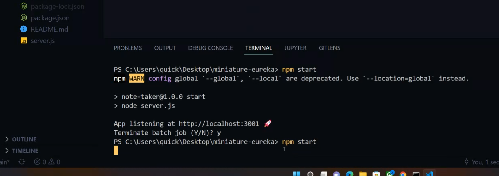
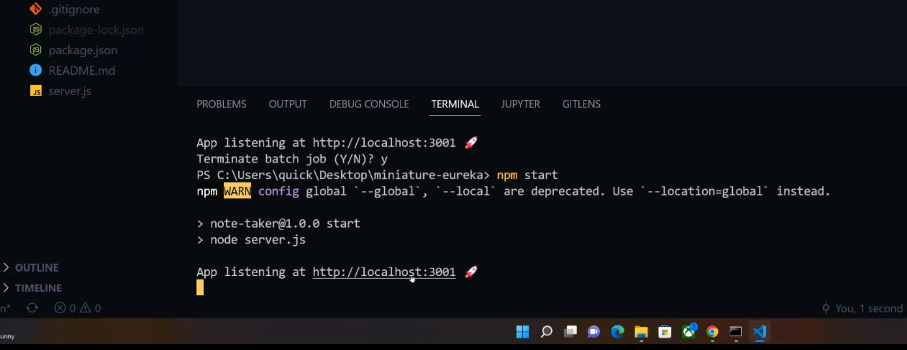
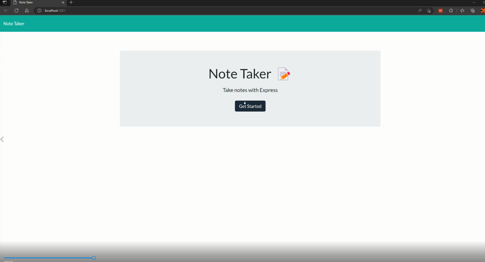
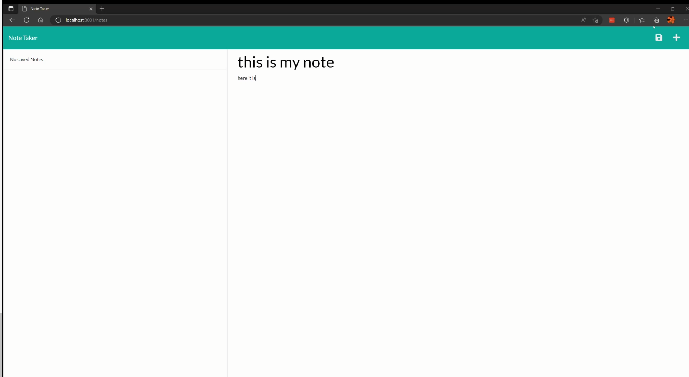
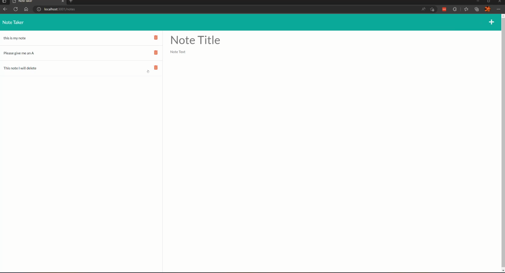

# NAmazing Note Taker

#### [Github repo source](https://github.com/quicksilver524/Amazing-note-taker)

## Description:

######  This is a *Note Taker* app that allows the individual to write a note, delete a note and save the note. You can save multiple notes that will be saved within the db file and folder keeping previously written data for later use. 

## Walkthrough Video:

https://user-images.githubusercontent.com/102430476/176795009-feb2580b-02b7-428c-a503-dd1e32472d3f.mp4

# Open New terminal within VS code or cmdline and type *npm start*: 

# click the link in the opened port within VS code or cmdline: 

# open note taker: 

# Write a note and save it: 

# Delete your notes written that are saved: 

